# aws-infra-atividade

## 1 - Criação de Security Groups (Grupos de Segurança):

### a - Security Group para EC2:

* Acesse o AWS Console > EC2 > Security Groups;
* Clique em "Create security group":
  
  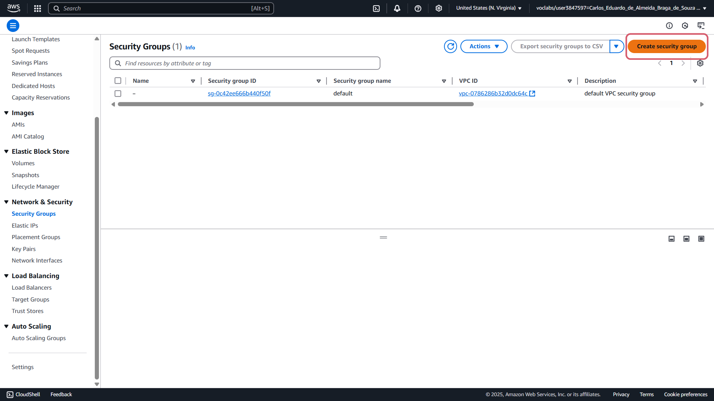

* Adicione "Security group name" e "Description":

  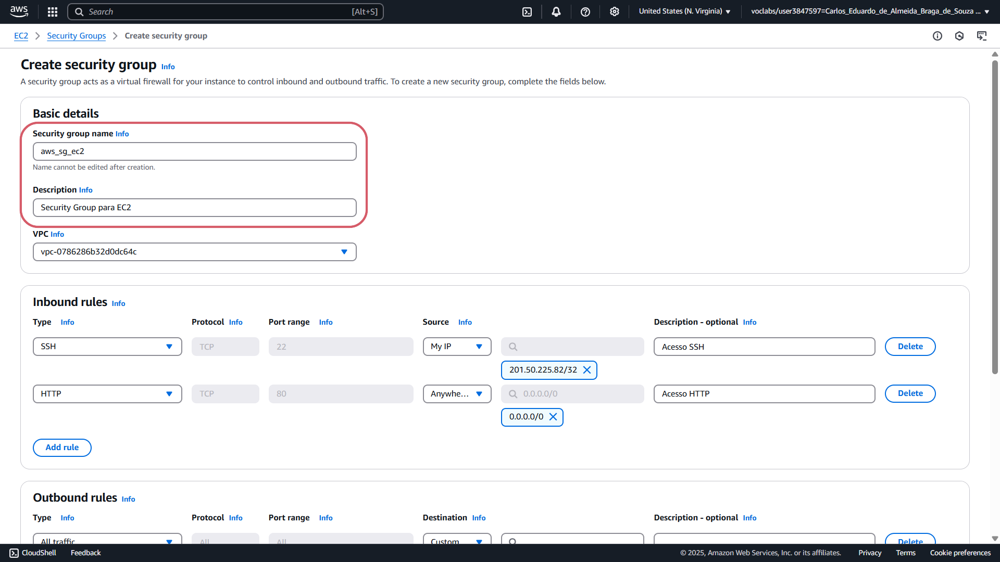

* Adicione as regras para liberar acesso SSH (porta 22) para o IP pessoal e para liberar acesso HTTP (porta 80) ou Custom para qualquer IP(0.0.0.0/0):

   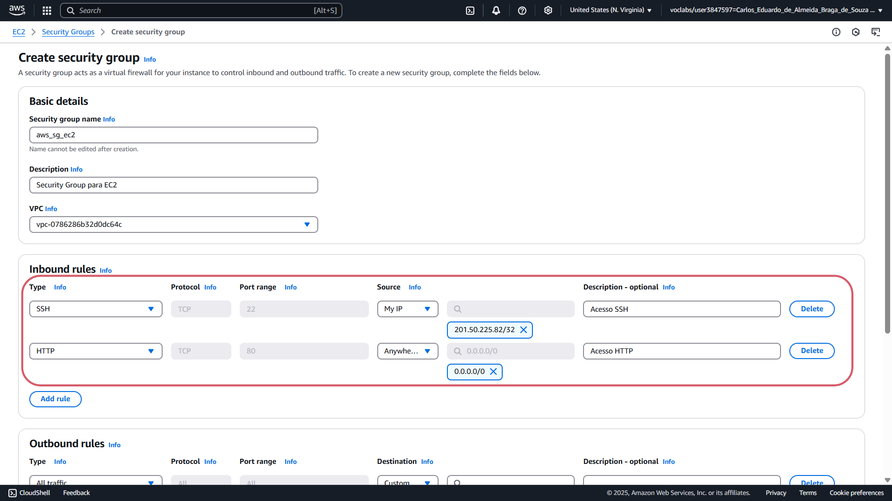

* Clique em "Create security group" para criar:

  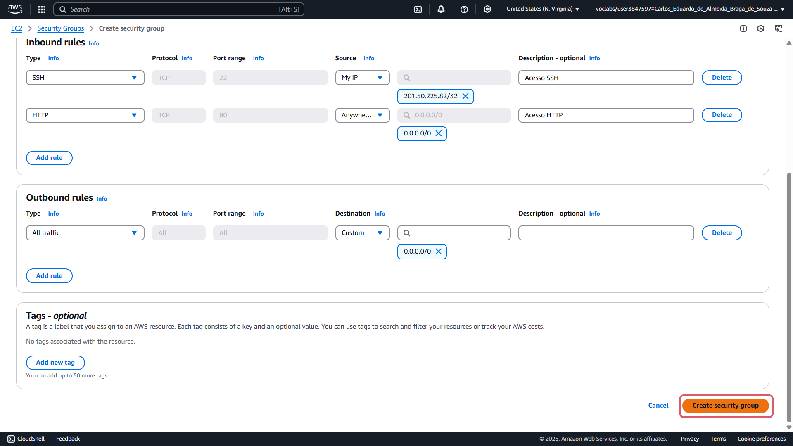

* Após a criação, aparecerá que o security group foi criado com sucesso:

  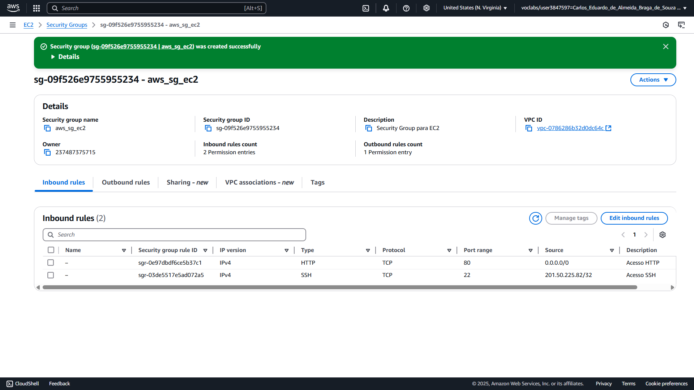

### b - Security Group para RDS:

* Acesse o AWS Console > EC2 > Security Groups;
* Clique em "Create security group":
  
  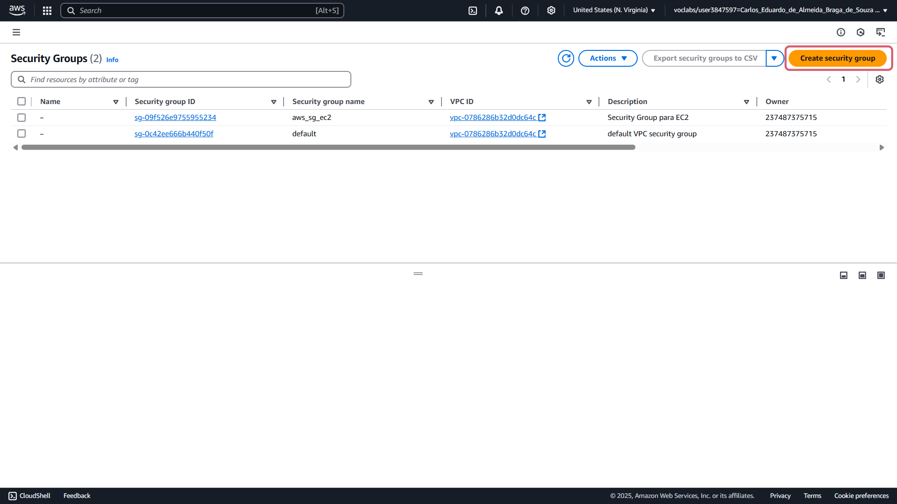

* Adicione "Security group name" e "Description":

  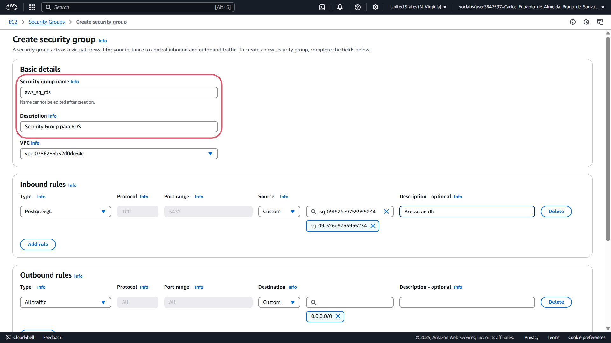

* Adicione a regra para permitir conexão PostgreSQL (porta 5432) apenas para o Security Group da EC2 criado anteriormente:

   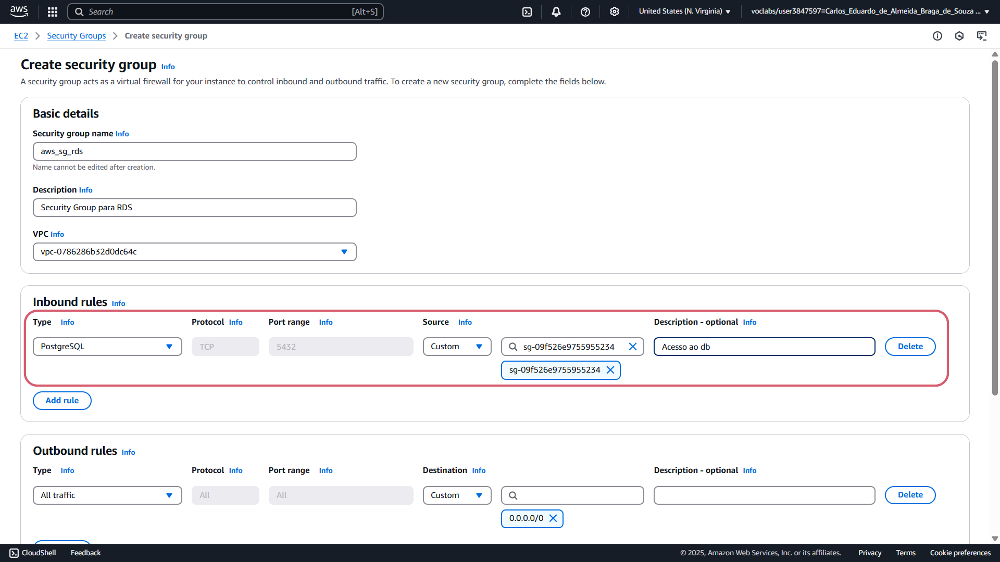

* Clique em "Create security group" para criar:

  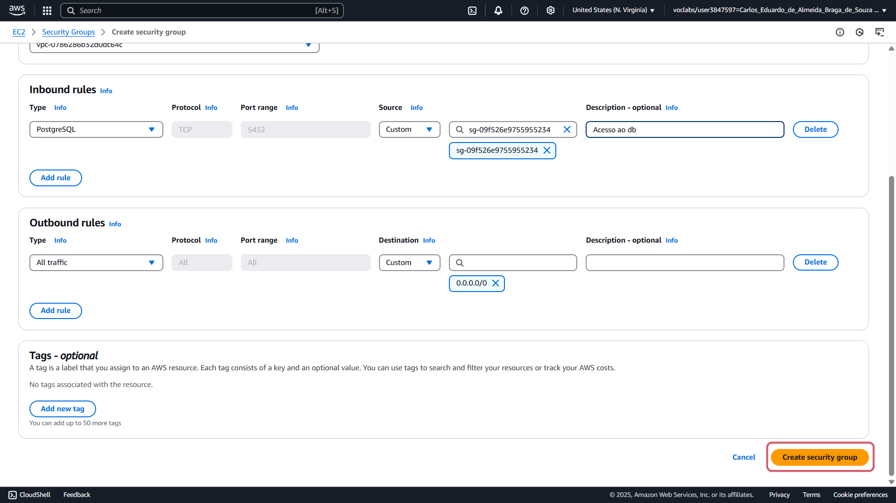

* Após a criação, aparecerá que o security group foi criado com sucesso:

  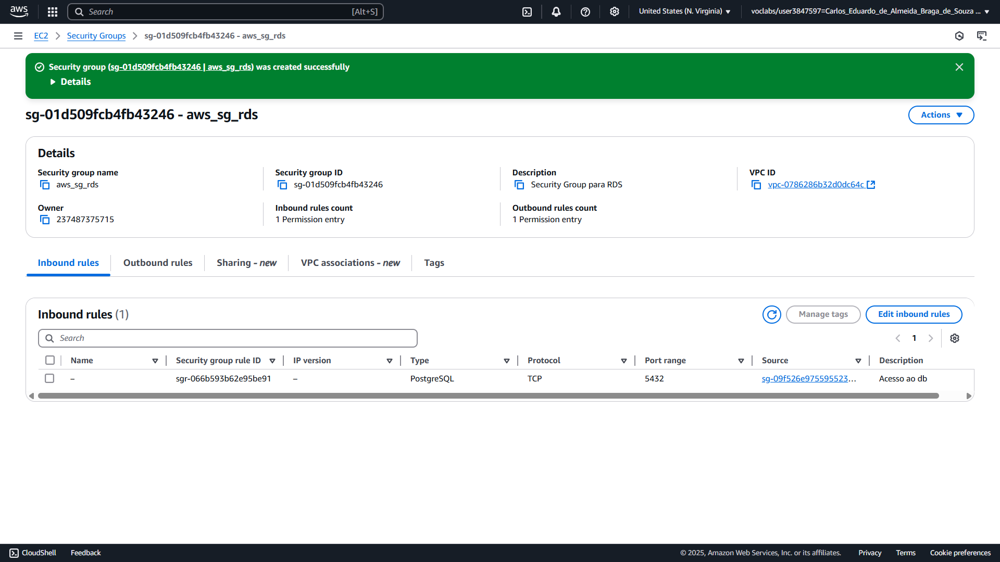

## 2 - Criar uma Instância EC2:

* Acesse AWS Console > EC2 > Instances;
* Clique em "Launch Instances":

  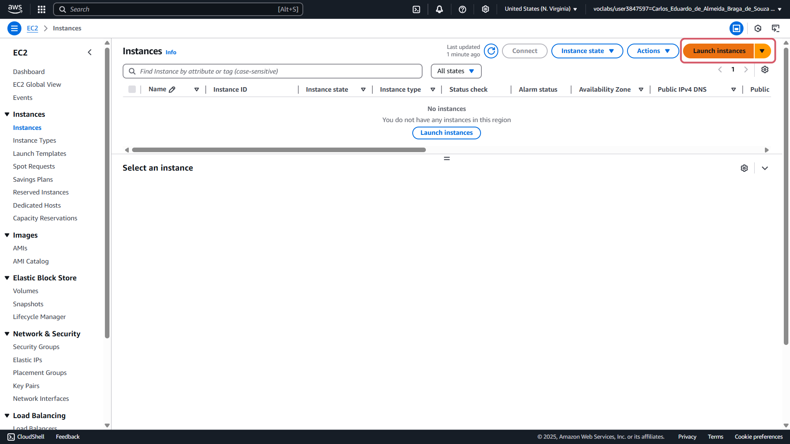

  
  

