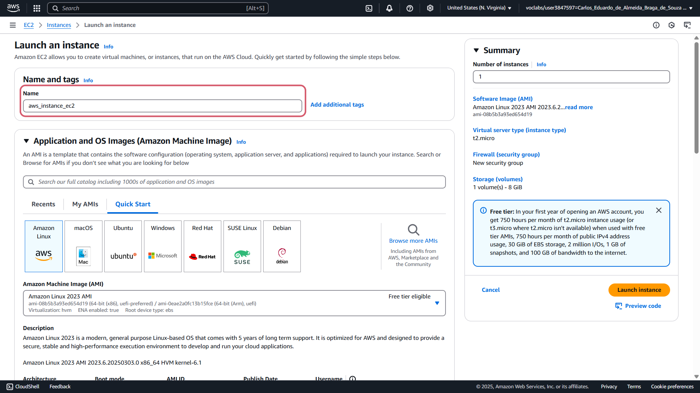
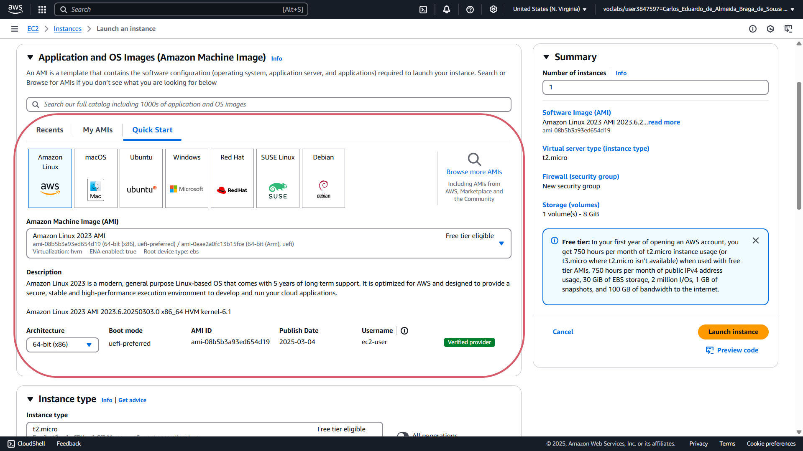
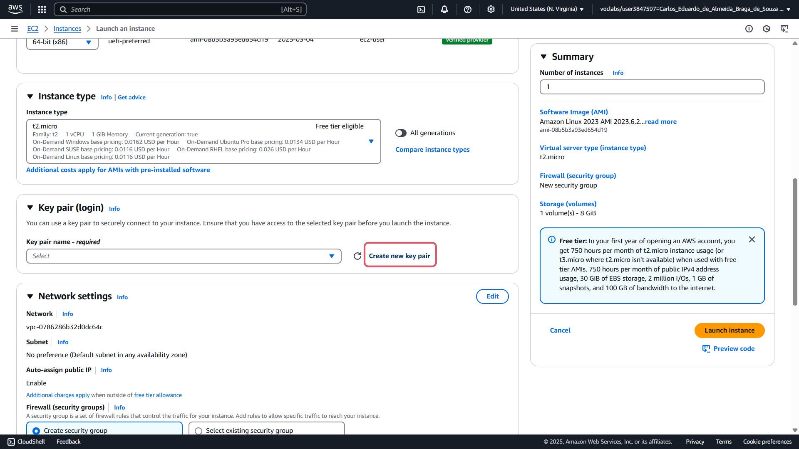
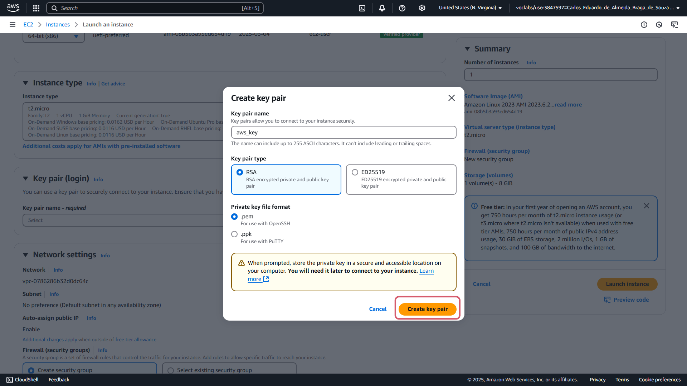
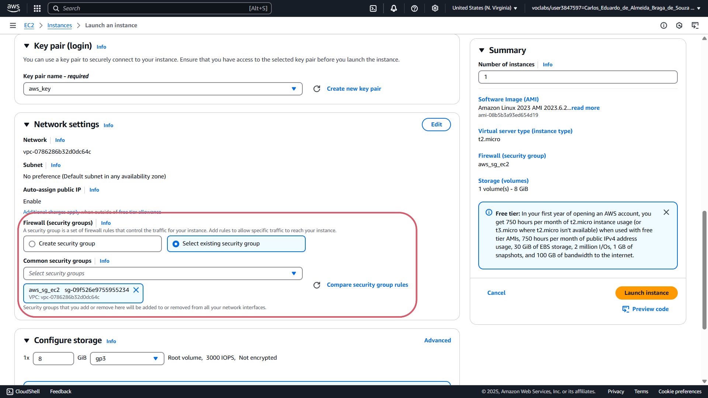
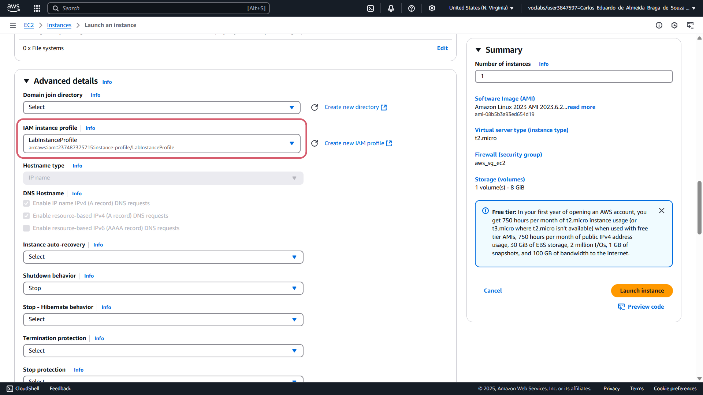
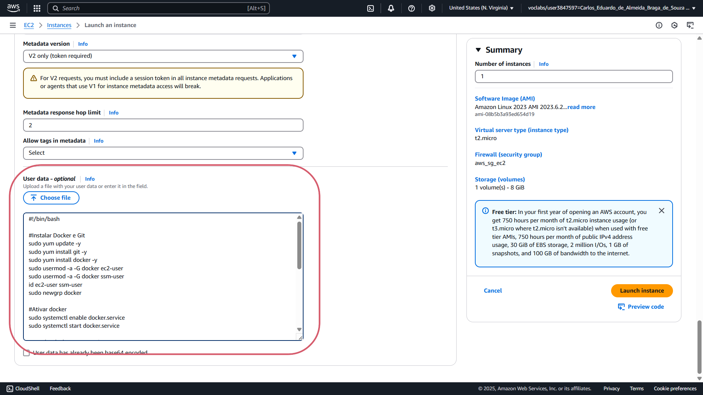

# aws-infra-atividade

## 1 - Criação de Security Groups (Grupos de Segurança):

### a - Security Group para EC2:

* Acesse o AWS Console > EC2 > Security Groups;
* Clique em "Create security group":
  
  

* Adicione "Security group name" e "Description":

  

* Adicione as regras para liberar acesso SSH (porta 22) para o IP pessoal e para liberar acesso HTTP (porta 80) ou Custom para qualquer IP(0.0.0.0/0):

   

* Clique em "Create security group" para criar:

  

* Após a criação, aparecerá que o security group foi criado com sucesso:

  


### b - Security Group para RDS:

* Acesse o AWS Console > EC2 > Security Groups;
* Clique em "Create security group":
  
  

* Adicione "Security group name" e "Description":

  

* Adicione a regra para permitir conexão PostgreSQL (porta 5432) apenas para o Security Group da EC2 criado anteriormente:

   

* Clique em "Create security group" para criar:

  

* Após a criação, aparecerá que o security group foi criado com sucesso:

  


## 2 - Criar uma Instância EC2:

* Acesse AWS Console > EC2 > Instances;
* Clique em "Launch Instances":

  

* Adicione um nome para a instância:

  

* Selecione a AMI:

  

* Instance type não foi alterado, permanecendo t2.micro;
  
* Clique em "Create new key pair", para criar um novo par de chaves:
  
  

* Defina o nome, tipo e formato do par de chaves e clique em "Create key pair":

  

* Em Network settings, selecione a opção "Select existing security group" e associe o Security Group criado anteriormente para a EC2.

  

* Em "Advanced details" na opção "IAM instance profile", foi selecionada a opção "LabInstanceProfile":

  

* Em "User data - optional" foi utilizado o script abaixo para iniciar a instância com alguns serviços pré instalados:

  

  ```sh

  #!/bin/bash

  #Instalar Docker e Git
  sudo yum update -y
  sudo yum install git -y
  sudo yum install docker -y
  sudo usermod -a -G docker ec2-user
  sudo usermod -a -G docker ssm-user
  id ec2-user ssm-user
  sudo newgrp docker

  #Ativar docker
  sudo systemctl enable docker.service
  sudo systemctl start docker.service

  #Instalar docker compose 2
  sudo mkdir -p /usr/local/lib/docker/cli-plugins
  sudo curl -SL https://github.com/docker/compose/releases/download/v2.23.3/docker-compose-linux-x86_64 -o /usr/local/lib/docker/cli-plugins/docker-compose
  sudo chmod +x /usr/local/lib/docker/cli-plugins/docker-compose


  #Adicionar swap
  sudo dd if=/dev/zero of=/swapfile bs=128M count=32
  sudo chmod 600 /swapfile
  sudo mkswap /swapfile
  sudo swapon /swapfile
  sudo echo "/swapfile swap swap defaults 0 0" >> /etc/fstab


  #Instalar node e npm
  curl -fsSL https://rpm.nodesource.com/setup_21.x | sudo bash -
  sudo yum install -y nodejs

  ```

